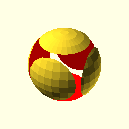

# OpenSCAD Class

February 12 2023



---

# What We're Doing Today

 * Learn how to build 3D models on a computer
 * Learn how to print / cut them on the machines
 * Class assumes programming experience.

---

# What is OpenSCAD?

 * [3D Printable QR Codes](https://www.thingiverse.com/thing:46884)
 * [3D Printable Lock Keys](https://hackaday.io/project/27631-3d-printing-real-world-keys/log/68517-better-modeling)
 * [Nut/Bolt Framework](https://www.thingiverse.com/thing:193647) (SEE: `nut.stl`)
 * [Flexible Coupling](https://www.thingiverse.com/thing:44078)
 * [A 3D Printed Peristaltic Pump](https://hackaday.com/2014/09/16/a-3d-printed-peristaltic-pump/)
 * [An Entire Theme Park](https://twitter.com/MPHtechnology/status/926495481534078976)

---

# What Is It?

 * Computer code => 2D/3D CAD Designs 
 * _Not_ interactive. No point-and-click.
 * Objects + Transformations = CAD design
 * Example: A pipe is a cylinder with a cylinder "subtracted" from its center.
---

# Why OpenSCAD

 * Parametric Design: Usecase serial numbers, key cutting, pipe adapters, QR Codes
 * Text is easy to automate, store, version, transform, etc..
   * Easily integrates into larger applications/scripts
 * Open source = community driven and free
 * Light weight, runs in desktop or [browser](https://openscad.cloud/openscad/) 
 * Supports 3D and 2D CAD (laser cutter, 3D printer, X-Carve, etc..)

---
# Disadvantages

 * Higher learning curve
 * Assumes computer programming experience:
   * loops
   * variables
   * modules / imports
 * You will forget to add semicolons, I promise.

---

# Installation

 * Web Version: https://openscad.cloud/openscad/
 * Desktop Version: https://openscad.org/
 * "Advanced" setup with VSCode.
 * Derivitive works: [Implicitcad](https://implicitcad.org/), [OpenJSCad](https://openjscad.xyz/#)

---

# Our First OpenSCAD Design

```c

translate([0, 0, -10]) {
  circle(10);
};

sphere(r=10);

```

---

# Color

```c

translate([0,0,-10]) {
  color("green") {
    circle(10);
  };
};

translate([0,0,-10]) {
  color("blue") {
    circle(10);
  };
};

color("red") {
  sphere(r=10);
};

```

---


# No Curly Braces

```c

translate([0,0,-10]) color("blue") circle(10);

color("red") sphere(r=10);

```

---


# Square / Cube / Cylinder


```c

color("blue") square(12);
color("red") cube(10);
color("green") cube([8, 16, 24]);

```

---

# Union / Difference / Intersection / Hull

Let's examine all four.

```c
translate([0,20,0]) hull() {
  sphere(10);
  translate([-10, 0, 0]) sphere(10);
}
translate([0,0,0])  union() {
  sphere(10);
  translate([-10, 0, 0]) sphere(10);
}
translate([0,-40,0]) intersection() {
  sphere(10);
  translate([-10, 0, 0]) sphere(10);
}
translate([0,-20,0]) difference() {
  sphere(10);
  translate([-10, 0, 0]) sphere(10);
}
```

---

# 2D CAD

Example: Computer generated serial number tag / name tag.

```c
difference() {
  square([48, 12]);
  translate([46, 10, 0]) circle(d = 2);
  translate([3, 3, 0]) text("01GS3TWM8KVFY9", size=3);
}
```
---
# Variables and "Parametric" Design

```c
scale_factor = 50; // Try changing this.

intersection() {
  sphere(scale_factor);
  translate([-(scale_factor*2), 0, 0]) sphere(scale_factor * 2);
}

```
---
# Special Variables, Part I

| Variable  | Usage                                |
|-----------|--------------------------------------|
| $fa       | minimum angle                        |
| $fs       | minimum size                         |
| $fn       | number of fragments                  |
| $t        | animation step                       |
| $vpr      | viewport rotation angles in degrees  |

---

# Special Variables, Part II

| Variable  | Usage                                |
|-----------|--------------------------------------|
| $vpt      | viewport translation                 |
| $vpd      | viewport camera distance             |
| $vpf      | viewport camera field of view        |
| $children | number of module children            |
| $preview  | true in F5 preview, false for F6     |

---

# Modifier Characters

|Symbol | Usage       |
|-------|-------------|
| #     | debug       |
| %     | transparent |
| *     | disable     |
| !     | show only   |

---
# import("….stl")

 * See `ducky.stl`. Might crash the machine!!! Set `$fn` low!

```c
$fn = 1;

import("ducky.stl");
```

---


# Modules

SEE `LetterBlock.scad` in OpenSCAD "Examples" section.

```c

module pear(scale_factor = 50) {
  hull() {
    translate([0, 0, -(scale_factor*2)]) sphere(scale_factor * 2);
    sphere(scale_factor);
  }
}

pear(2);
translate([0, 9, 0]) pear(4);
translate([0, 24, 0]) pear(6);
```

---
# Extrusion

```c
rotate_extrude() translate([20, 0, 0]) circle(r = 10);
linear_extrude() translate([40, 0, 0]) circle(r = 10);
```

---

# Minkowski Transform

* Think of a Roomba.

```c
minkowski() {
  cube([10,10,1]);
  cylinder(r=2,h=1);
}
```

---
# Stuff I Did Not Cover

Now we will move on to higher-level topics.

Here are things you can research independently:

 * `function`
 * `mirror`
 * `resize`
 * `rotate`
 * `scale`
 * `use`

---

# DXF Output: Laser Cut Your Design

Let's use the 2D esign from before.

 * Possible to produce 2D designs.
 * Usually DXF files.
 * Useful for plates, serial numbers, etc...
---


# STL Output: 3D Printing your Design

 * What is GCode?
 * What is "Slicing"?

---

# Exploring the Settings Menu

Let's take a look.

---
# Other Resources

 * [MCAD](https://github.com/openscad/MCAD)
 * [BOSL](https://github.com/revarbat/BOSL)
 * [BOLTS](https://boltsparts.github.io/en/parts/names/V_slot20x20mm.html)
 * [Model a Bearing in 10 Minutes](https://www.youtube.com/watch?v=kSqpdPrJAqg)

---
# Exercise

 * Build a pipe that can be customized via the customizer:
   * Pipe length
   * Pipe outter diameter
   * Pipe inner diameter
   * Color
---

# Thanks!

---
