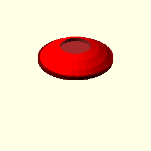
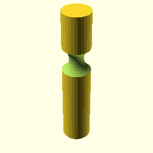
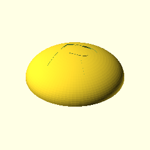

## Openscad Models

Shared models in openscad for sharing, learning, blah, blah.

## How To Build

Render all *.scad files and update the README in one swoop!

```
ruby build.rb
```

# Notes

Files that `_start_with_an_underscore` won't be rendered.

# booleans.scad


# button.scad




# carved_rod_or_whatever.scad




# chasis.scad


# cool_ball_wow.scad


# domed_button.scad




# funnel.scad


# lemon.scad


# pestel.scad


